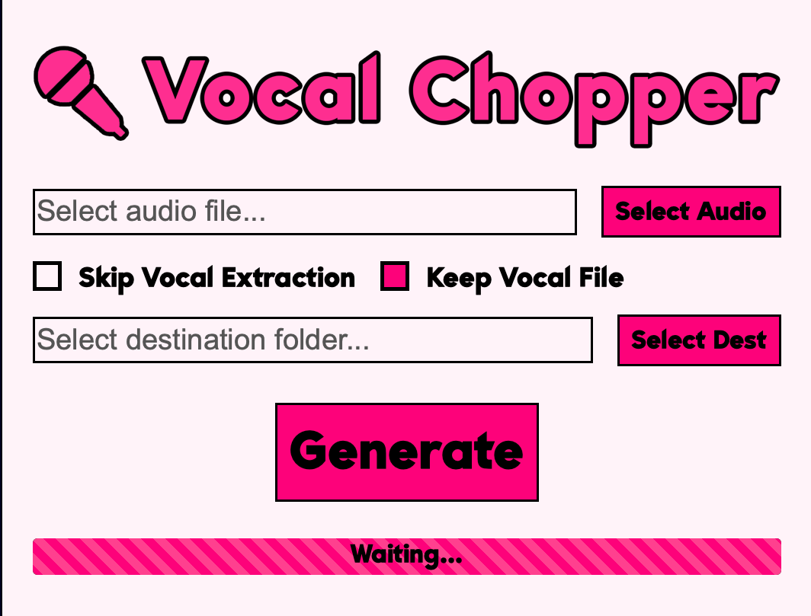

# Vocal Chopper



Vocal Chopper is a plugin that aids in making vocal chops. It can take any audio clip 
that contains human singing, extracts out only the vocals, and then chops it along 
regions of interest. 

It uses demucs to isolate the vocal track and crepe to detect pitch regions. As it 
utilizes machine learning, it can get computationally intensive. That is a trade off you 
make to get good quality results.

You must have python3 installed, as the plugin is essentially a wrapper around the 
python script. Alternatively, you can simply take and run the script in python/chopper.py 
if you are fine running it from the command line. If you have trouble running it, you 
can try installing the dependencies:

```
pip3 install crepe demucs librosa soundfile tensorflow onnxruntime --compile --force-reinstall
```

### Installation

Download from the [releases](https://github.com/Moebits/Vocal-Chopper/releases) tab and rescan the plugins in your DAW.

### Building

Release build - `npm install` and `npm run build`. 

Debug build - I run the project with the VSCode debugger and use `npm start` to start the frontend 
server. You must install the AudioPluginHost from JUCE and put it in your applications folder. 

### Credits

- [Demucs](https://github.com/facebookresearch/demucs)
- [Crepe](https://github.com/marl/crepe)